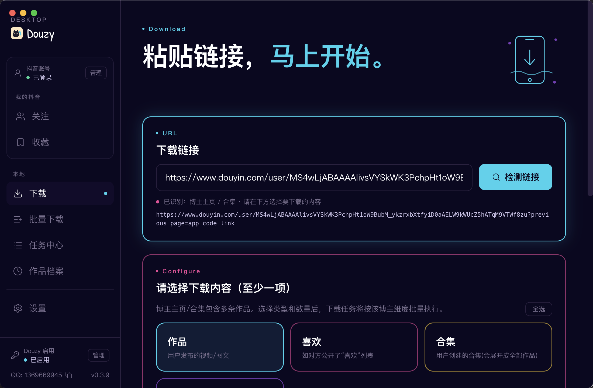
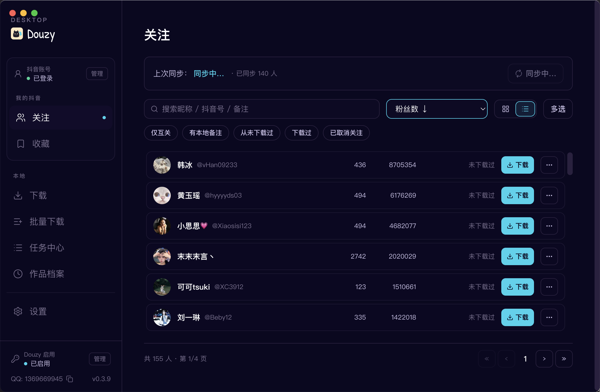
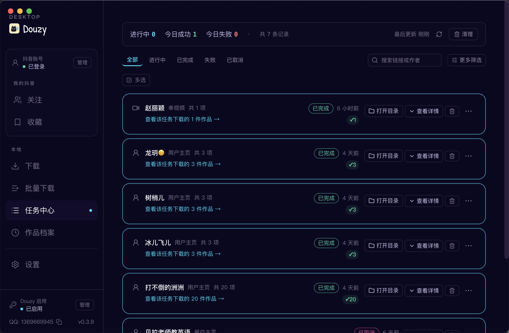
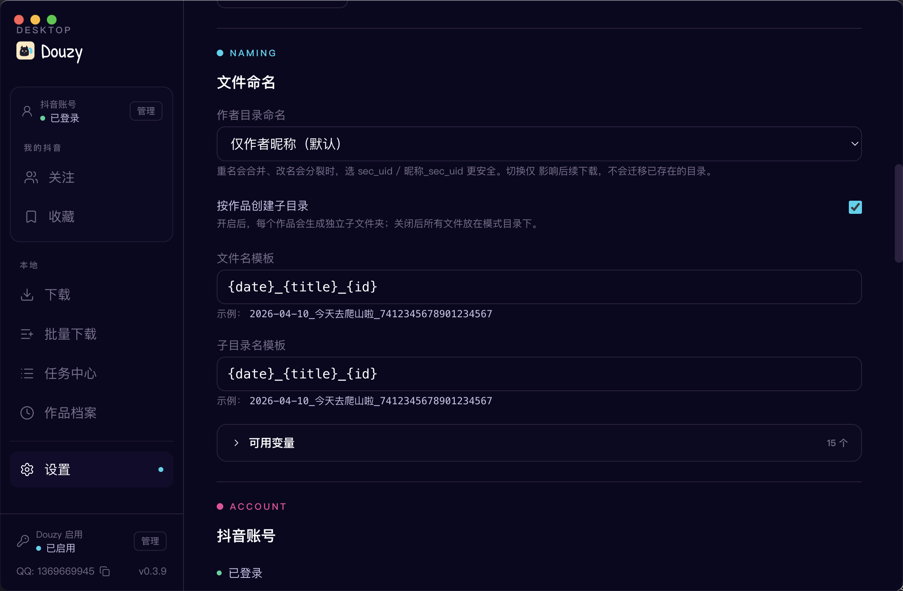
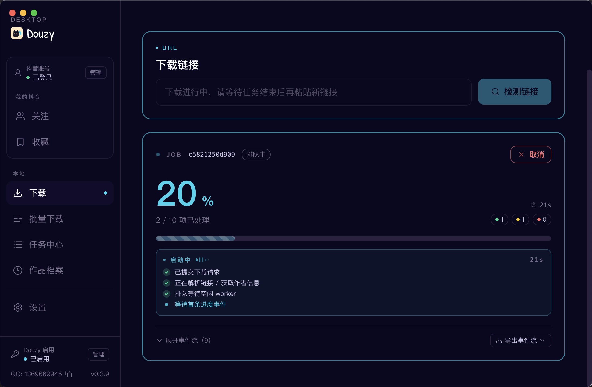

# 抖音下载器 V2.0（Douyin Downloader）

<p align="center">
  
</p>

一个面向实用场景的抖音下载工具，支持视频、图文、合集、音乐、收藏夹等多种类型下载，以及作者主页批量下载，默认带进度展示、重试、数据库去重、下载完整性校验和浏览器兜底能力。

## 桌面版（Douzy）

基于同一套后端打造的桌面客户端——粘贴链接即刻开始，同步关注列表，可视化跟踪下载进度。

> **内测中：** 桌面版目前处于内测期，如需使用，请到 [Releases](https://github.com/jiji262/douyin-downloader/releases) 页面下载安装文件。

<table>
  <tr>
    <td width="33%"><br/><sub>下载 · 粘贴链接即刻开始</sub></td>
    <td width="33%"><br/><sub>关注 · 同步博主列表</sub></td>
    <td width="33%"><br/><sub>任务中心 · 逐任务状态</sub></td>
  </tr>
  <tr>
    <td width="33%"><br/><sub>作品档案 · SQLite 历史与筛选</sub></td>
    <td width="33%"><br/><sub>设置 · 文件命名模板</sub></td>
    <td width="33%"><br/><sub>实时进度 · 逐任务事件日志</sub></td>
  </tr>
</table>

## 目录

- [环境要求](#环境要求)
- [安装教程](#安装教程)
- [登录抖音（获取 Cookie）](#登录抖音获取-cookie)
- [快速开始：你的第一次下载](#快速开始你的第一次下载)
- [配置说明](#配置说明)
- [使用方式](#使用方式)
- [典型场景](#典型场景)
- [收藏夹下载详解](#收藏夹下载详解)
- [视频转写（Transcript）](#视频转写transcript)
- [高级功能](#高级功能)
- [输出目录结构](#输出目录结构)
- [重新下载](#重新下载)
- [常见问题](#常见问题)
- [调试工具](#调试工具)
- [测试](#测试)
- [沟通群](#沟通群)
- [免责声明](#免责声明)
- [许可证](#许可证)

---

## 环境要求

| 项目 | 要求 |
|------|------|
| **操作系统** | Windows / macOS / Linux |
| **Python** | 3.8 及以上（推荐 3.10+） |
| **网络** | 能正常访问抖音（`douyin.com`） |

> **Windows 用户特别注意：** 建议将系统环境变量 `PYTHONIOENCODING` 设为 `utf-8`，避免 Rich 进度条出现 GBK 编码错误。

---

## 安装教程

### 第一步：克隆项目

```bash
git clone https://github.com/jiji262/douyin-downloader.git
cd douyin-downloader
```

### 第二步：安装核心依赖

```bash
pip install -r requirements.txt
```

核心依赖清单：

| 包名 | 版本 | 用途 |
|------|------|------|
| `aiohttp` | ≥3.9.0 | 异步 HTTP 请求（API 调用 + 媒体下载） |
| `aiofiles` | ≥23.2.1 | 异步文件读写 |
| `aiosqlite` | ≥0.19.0 | 异步 SQLite 数据库（去重 + 历史记录） |
| `rich` | ≥13.7.0 | 终端进度条与美化输出 |
| `pyyaml` | ≥6.0.1 | YAML 配置文件解析 |
| `python-dateutil` | ≥2.8.2 | 日期解析 |
| `gmssl` | ≥3.2.2 | 国密 SSL / 签名算法 |
| `imageio-ffmpeg` | 0.6.0 | ffmpeg 静态二进制（转写时提取音频） |
| `croniter` | ≥6.0.0 | Cron 表达式解析（定时同步） |

### 第三步（可选）：安装可选依赖

根据不同使用场景，你可能还需要安装以下内容：

**浏览器兜底 / 自动获取 Cookie：**
```bash
pip install playwright
python -m playwright install chromium
```

**REST API 服务模式：**
```bash
pip install fastapi uvicorn
```

**本地 Whisper 转写（无需 OpenAI API Key）：**
```bash
pip install faster-whisper
```

**转写后繁体→简体转换（可选）：**
```bash
pip install opencc
```

---

## 登录抖音（获取 Cookie）

首次使用前，需要获取抖音的登录 Cookie。提供三种方式：

### 方式一：自动获取（推荐）

运行内置的 Cookie 获取工具，程序会自动打开浏览器，你在浏览器中手动登录抖音后，回到终端按 Enter 即可：

```bash
python -m tools.cookie_fetcher --config config.yml
```

**流程说明：**
1. 程序启动 Chromium 浏览器，打开抖音首页
2. 在浏览器中完成抖音登录（扫码或手机号）
3. 确认已登录后，回到终端按 **Enter**
4. 程序自动抓取 Cookie 并写入 `config.yml`

`cookie_fetcher` 支持以下参数：

| 参数 | 说明 |
|------|------|
| `--config PATH` | 指定要更新的配置文件（默认写入 `config/cookies.json`） |
| `--browser` | 浏览器引擎，可选 `chromium`（默认）/`firefox`/`webkit` |
| `--headless` | 无头模式（不推荐，手动登录需要看到浏览器窗口） |
| `--include-all` | 保存 douyin.com 域下的所有 Cookie（默认只保存核心 Cookie） |

### 方式二：手动填写

如果你已经通过浏览器开发者工具拿到了 Cookie，可以直接编辑 `config.yml`：

```yaml
cookies:
  msToken: "你的_msToken"
  ttwid: "你的_ttwid"
  odin_tt: "你的_odin_tt"
  passport_csrf_token: "你的_passport_csrf_token"
  sid_guard: "你的_sid_guard"
```

**获取方法：** 浏览器打开抖音 → F12 开发者工具 → Application/存储 → Cookies → `douyin.com` → 找到对应字段的值。

### 方式三：自动重登

如果下载过程中 Cookie 失效，程序会自动检测并弹出浏览器让你重新登录（非服务模式下）。登录成功后自动继续下载。

### Cookie 说明

| Cookie 字段 | 重要性 | 说明 |
|-------------|--------|------|
| `msToken` | **必需** | 动态 Token，API 签名依赖 |
| `ttwid` | **必需** | 设备标识 |
| `odin_tt` | **必需** | 用户身份标识 |
| `passport_csrf_token` | **必需** | CSRF 防护 Token |
| `sid_guard` | 建议 | 会话守护 |
| `sessionid` | 建议 | 会话 ID |
| `sid_tt` | 建议 | 会话 TT |

> Cookie 有效期通常 7-30 天。过期后重新执行 `python -m tools.cookie_fetcher --config config.yml` 即可。

---

## 快速开始：你的第一次下载

### 1) 创建配置文件

```bash
cp config.example.yml config.yml
```

### 2) 获取 Cookie

```bash
python -m tools.cookie_fetcher --config config.yml
```

### 3) 编辑 `config.yml`，填入你要下载的链接

```yaml
link:
  - https://www.douyin.com/user/MS4wLjABAAAAxxxx   # 替换为实际链接

mode:
  - post

number:
  post: 10    # 先下 10 个试试
```

### 4) 运行

```bash
python run.py -c config.yml
```

**Windows 用户：** 如遇编码错误，使用：

```bash
PYTHONIOENCODING=utf-8 python run.py -c config.yml
```

---

## 配置说明

### 最小可用配置

```yaml
link:
  - https://www.douyin.com/user/MS4wLjABAAAAxxxx

path: ./Downloaded/
mode:
  - post

number:
  post: 0
  collect: 0
  collectmix: 0

thread: 5
retry_times: 3
proxy: ""
database: true
database_path: dy_downloader.db

progress:
  quiet_logs: true

cookies:
  msToken: ""
  ttwid: YOUR_TTWID
  odin_tt: YOUR_ODIN_TT
  passport_csrf_token: YOUR_CSRF_TOKEN
  sid_guard: ""

browser_fallback:
  enabled: true
  headless: false
  max_scrolls: 240
  idle_rounds: 8
  wait_timeout_seconds: 600

transcript:
  enabled: false
  model: gpt-4o-mini-transcribe
  output_dir: ""
  response_formats: ["txt", "json"]
  api_url: https://api.openai.com/v1/audio/transcriptions
  api_key_env: OPENAI_API_KEY
  api_key: ""
```

### 全部配置项

| 配置项 | 类型 | 默认值 | 说明 |
|--------|------|--------|------|
| `link` | list | — | 要下载的链接列表 |
| `path` | str | `./Downloaded/` | 下载保存目录 |
| `mode` | list | `[post]` | 下载模式：`post`/`like`/`mix`/`music`/`collect`/`collectmix` |
| `number.*` | int | 0 | 各模式下载数量限制（0 = 不限） |
| `increase.*` | bool | false | 各模式增量下载开关 |
| `start_time` / `end_time` | str | `""` | 时间过滤（格式 `YYYY-MM-DD`） |
| `thread` | int | 5 | 并发下载数 |
| `retry_times` | int | 3 | 失败重试次数 |
| `proxy` | str | `""` | HTTP/HTTPS 代理，如 `http://127.0.0.1:7890` |
| `database` | bool | true | 启用 SQLite 去重和历史记录 |
| `database_path` | str | `dy_downloader.db` | 数据库文件路径 |
| `music` | bool | true | 是否下载音乐 |
| `cover` | bool | true | 是否下载封面 |
| `avatar` | bool | true | 是否下载头像 |
| `json` | bool | true | 是否保存 JSON 元数据 |
| `folderstyle` | bool | true | 按作品维度创建子目录 |
| `filename_template` | str | `{date}_{title}_{id}` | 文件命名模板 |
| `folder_template` | str | `{date}_{title}_{id}` | 目录命名模板 |
| `author_dir` | str | `nickname` | 作者目录命名方式：`nickname`/`sec_uid`/`nickname_uid` |
| `download_pinned` | bool | false | 是否下载作者主页置顶作品 |
| `progress.quiet_logs` | bool | true | 进度阶段静默日志 |
| `browser_fallback.*` | — | — | 浏览器兜底配置 |
| `transcript.*` | — | — | 视频转写配置（详见下方） |
| `comments.*` | — | — | 评论采集配置 |
| `live.*` | — | — | 直播录制配置 |
| `notifications.*` | — | — | 下载完成通知配置 |
| `server.*` | — | — | REST API 服务配置 |

### 命名模板变量

`filename_template` 和 `folder_template` 支持以下变量（要求模板中至少包含 `{id}` 以避免重名覆盖）：

| 变量 | 说明 | 示例 |
|------|------|------|
| `{id}` | 作品 aweme_id | `7604129988555574538` |
| `{title}` | 作品标题 | `今日份美食分享` |
| `{author}` | 作者昵称 | `张三` |
| `{author_id}` | 作者 sec_uid | `MS4wLjABAAAAxxxx` |
| `{date}` | 发布日期 | `2024-02-07` |
| `{year}` / `{month}` / `{day}` | 年/月/日 | `2024` / `02` / `07` |
| `{time}` | 发布时间 | `14:30:00` |
| `{timestamp}` | Unix 时间戳 | `1707292800` |
| `{type}` | 作品类型 | `video` / `note` |
| `{mode}` | 下载模式 | `post` / `like` / `collect` |

---

## 使用方式

### 使用配置文件运行

```bash
python run.py -c config.yml
```

### 命令行追加参数

```bash
python run.py -c config.yml \
  -u "https://www.douyin.com/video/7604129988555574538" \
  -t 8 \
  -p ./Downloaded
```

### 全部命令行参数

| 参数 | 说明 |
|------|------|
| `-u, --url` | 追加下载链接（可重复传入） |
| `-c, --config` | 指定配置文件（默认 `config.yml`） |
| `-p, --path` | 指定下载目录 |
| `-t, --thread` | 指定并发数 |
| `--show-warnings` | 显示 warning/error 日志 |
| `-v, --verbose` | 显示 info/warning/error 日志 |
| `--hot-board [N]` | 拉取抖音热搜榜并导出 JSONL，可选上限 N |
| `--search KEYWORD` | 按关键词搜索作品并导出 JSONL |
| `--search-max N` | `--search` 场景下最多拉取条数（默认 50） |
| `--serve` | 以 REST API 服务模式运行（需 `pip install fastapi uvicorn`） |
| `--serve-host HOST` | REST 服务监听地址（默认 127.0.0.1） |
| `--serve-port PORT` | REST 服务监听端口（默认 8000） |
| `--collect` | 交互式选择要下载的收藏夹 |
| `--collect-ids ID1,ID2` | 指定要下载的收藏夹 ID 列表（逗号分隔） |
| `--list-collections` | 列出当前账号所有收藏夹后退出 |
| `--sync` | 启动收藏夹定时同步 |
| `--sync-once` | 执行一次收藏夹同步后退出 |
| `--sync-cron CRON` | 设置同步 cron 表达式 |
| `--version` | 显示版本号 |

---

## 典型场景

### 下载单个视频

```yaml
link:
  - https://www.douyin.com/video/7604129988555574538
```

### 下载单个图文

```yaml
link:
  - https://www.douyin.com/note/7341234567890123456
```

### 下载单个合集

```yaml
link:
  - https://www.douyin.com/collection/7341234567890123456
```

### 下载单个音乐

```yaml
link:
  - https://www.douyin.com/music/7341234567890123456
```

### 批量下载作者主页作品

```yaml
link:
  - https://www.douyin.com/user/MS4wLjABAAAAxxxx
mode:
  - post
number:
  post: 50
```

### 批量下载作者点赞作品

```yaml
link:
  - https://www.douyin.com/user/MS4wLjABAAAAxxxx
mode:
  - like
number:
  like: 0    # 0 表示全量下载
```

### 同时下载多种模式

```yaml
link:
  - https://www.douyin.com/user/MS4wLjABAAAAxxxx
mode:
  - post
  - like
  - mix
  - music
```

跨模式自动去重：同一个 aweme_id 在不同模式下不会重复下载。

### 增量下载（只下载新作品）

```yaml
increase:
  post: true
database: true    # 增量模式依赖数据库记录
```

### 全量抓取（不限制数量）

```yaml
number:
  post: 0
```

---

## 收藏夹下载详解

收藏夹下载支持三种使用方式：交互式选择、指定 ID 列表、配置文件声明。

> **注意：** `collect` / `collectmix` 模式只能单独使用，不能和 `post` / `like` / `mix` / `music` 混用。并且只能下载**当前已登录 Cookie 对应账号**的收藏夹。

### 方式一：交互式选择（推荐新手）

```bash
python run.py -c config.yml --collect
```

程序会列出你账号下所有收藏夹（含名称和作品数量），然后提示你输入要下载的编号：

```
共 5 个收藏夹：

    1.  [123456789]  美食教程  （32 个作品）
    2.  [234567890]  旅行记录  （18 个作品）
    3.  [345678901]  搞笑合集  （56 个作品）
    4.  [456789012]  技术分享  （24 个作品）
    5.  [567890123]  音乐收藏  （41 个作品）

输入要下载的收藏夹编号（多个用逗号分隔，支持范围如 1-5，输入 all 全选）：
```

支持的选择格式：
- `3` — 单个
- `1,3,5` — 逗号分隔多个
- `1-5` — 连续范围
- `1,3-5,8` — 混合
- `all` / `a` — 全选

选定后自动开始下载，每个收藏夹的视频会保存到独立目录：`Downloaded/collect/{id}_{收藏夹名称}/`。

### 方式二：列出所有收藏夹后指定 ID

先查看有哪些收藏夹：

```bash
python run.py -c config.yml --list-collections
```

然后用 `--collect-ids` 指定要下载的：

```bash
python run.py -c config.yml --collect-ids 123456789,234567890
```

### 方式三：配置文件声明

在 `config.yml` 中：

```yaml
link:
  - https://www.douyin.com/user/self?showTab=favorite_collection
mode:
  - collect       # 收藏的作品
  # - collectmix  # 收藏的合集
number:
  collect: 0      # 0 = 全量下载
```

### 收藏夹定时同步

如果你希望定期自动同步收藏夹中的新作品，可以配置定时同步：

```bash
# 执行一次同步
python run.py -c config.yml --sync-once

# 启动定时同步（需要先配置 sync.enabled: true）
python run.py -c config.yml --sync --sync-cron "0 */6 * * *"
```

### 收藏夹下载的目录结构

```
Downloaded/
└── collect/
    ├── 123456789_美食教程/
    │   └── 2024-02-07_作品标题_aweme_id/
    │       ├── ...mp4
    │       ├── ..._cover.jpg
    │       ├── ..._data.json
    │       └── ...transcript.txt
    └── 234567890_旅行记录/
        └── ...
```

---

## 视频转写（Transcript）

下载视频后自动将音频转为文字。支持**两种后端**：

| 后端 | 说明 | 需要 |
|------|------|------|
| **本地 Whisper**（默认） | 使用 faster-whisper 在本地运行，无需联网 | `pip install faster-whisper` |
| **OpenAI API** | 调用 OpenAI 云端转录接口 | OpenAI API Key |

### 1) 基础配置

```yaml
transcript:
  enabled: true
  backend: whisper              # 转录后端：whisper（本地）/ openai（云端）
  model: gpt-4o-mini-transcribe  # OpenAI 后端用的模型名
  whisper_model: base           # 本地 Whisper 模型大小：tiny/base/small/medium/large
  whisper_device: cpu           # 设备：cpu / cuda
  language: zh                  # 语言提示（zh = 中文）
  output_dir: ""                # 留空: 与视频同目录；非空: 镜像到指定目录
  response_formats:
    - txt
    - json
```

### 2) 使用本地 Whisper（推荐，免费）

```bash
# 安装 faster-whisper
pip install faster-whisper

# 可选：安装 OpenCC 实现繁体→简体自动转换
pip install opencc
```

配置：

```yaml
transcript:
  enabled: true
  backend: whisper
  whisper_model: base           # 模型越大越准但越慢。推荐：base 或 small
  whisper_device: cpu           # 有 NVIDIA GPU 可改为 cuda
  language: zh
  response_formats:
    - txt
    - json
```

**模型选择建议：**

| 模型 | 大小 | 速度 | 准确度 | 适合场景 |
|------|------|------|--------|----------|
| `tiny` | ~75MB | 最快 | 一般 | 快速测试 |
| `base` | ~145MB | 快 | 较好 | **日常使用推荐** |
| `small` | ~488MB | 中等 | 好 | 质量优先 |
| `medium` | ~1.5GB | 慢 | 很好 | 专业转录 |
| `large` | ~3GB | 很慢 | 最好 | 最高质量要求 |

首次使用时会自动下载模型文件。

### 3) 使用 OpenAI API

```yaml
transcript:
  enabled: true
  backend: openai
  model: gpt-4o-mini-transcribe
  api_url: https://api.openai.com/v1/audio/transcriptions
  api_key_env: OPENAI_API_KEY
  api_key: ""                  # 可直接填，或使用环境变量
  language_hint: zh
  response_formats:
    - txt
    - json
```

推荐通过环境变量提供密钥：

```bash
# Linux / macOS
export OPENAI_API_KEY="sk-xxxx"

# Windows PowerShell
$env:OPENAI_API_KEY = "sk-xxxx"
```

### 4) 输出文件

转写成功后会生成：

- `{视频文件名}.transcript.txt` — 纯文本转录内容
- `{视频文件名}.transcript.json` — 含时间戳的 JSON（含 `text`、`segments`、`language` 字段）

若 `database: true`，会在数据库 `transcript_job` 表记录每次转录的状态。

### 5) 注意事项

- 仅对**视频作品**生效，图文不会生成转写
- 本地 Whisper 默认使用 `int8` 量化（CPU），GPU 用户可设置 `whisper_device: cuda` 使用 `float16`
- 如果目标文件已存在转写结果，程序会自动跳过（增量逻辑）
- 转录是串行执行的（本地 Whisper 模型不支持并发），不会阻塞其他视频的下载
- 音频提取依赖 ffmpeg（`imageio-ffmpeg` 已内置，无需单独安装）

---

## 高级功能

### 浏览器兜底

当 API 翻页受限时（常见于 `post` 模式），自动启动浏览器采集作品列表：

```yaml
browser_fallback:
  enabled: true
  headless: false          # false = 可见窗口（可手动过验证码）
  max_scrolls: 240
  idle_rounds: 8
  wait_timeout_seconds: 600
```

### 评论采集

按作品抓取评论（含二级回复）：

```yaml
comments:
  enabled: true
  include_replies: false   # true = 每条评论额外拉二级回复
  max_comments: 500        # 0 = 不限
  page_size: 20
```

会在媒体文件旁生成 `{date}_{title}_{aweme_id}_comments.json`。

### 直播录制（实验性）

```yaml
link:
  - https://live.douyin.com/123456789
live:
  max_duration_seconds: 3600   # 0 = 录到主播下播
  chunk_size: 65536
  idle_timeout_seconds: 30
```

主播下播、网络空闲或 Ctrl+C 中断时，**已录制的数据会被保留**。

### 热搜榜 + 关键词搜索

```bash
# 拉取热搜榜（前 30 条）
python run.py --hot-board 30 -p ./Downloaded

# 关键词搜索
python run.py --search "猫咪" --search-max 100 -p ./Downloaded
```

### REST API 服务模式

```bash
pip install fastapi uvicorn
python run.py --serve --serve-port 8000
```

接口：

| Method | Path | 说明 |
|--------|------|------|
| POST | `/api/v1/download` | 提交下载任务 `{"url": "..."}` |
| GET | `/api/v1/jobs/{job_id}` | 查询任务状态 |
| GET | `/api/v1/jobs` | 列出最近任务 |
| GET | `/api/v1/health` | 健康探针 |

### 下载完成通知

```yaml
notifications:
  enabled: true
  on_success: true
  on_failure: true
  providers:
    - type: bark
      url: https://api.day.app/YOUR_DEVICE_KEY
      sound: bell
    - type: telegram
      bot_token: "123456:ABC..."
      chat_id: "987654321"
    - type: webhook
      url: https://qyapi.weixin.qq.com/cgi-bin/webhook/send?key=xxx
      extra_body:
        msgtype: text
```

### Docker 部署

```bash
docker build -t douyin-downloader .
docker run -v $(pwd)/config.yml:/app/config.yml -v $(pwd)/Downloaded:/app/Downloaded douyin-downloader
```

---

## 输出目录结构

默认 `folderstyle: true` 且 `database_path: dy_downloader.db` 时：

```text
工作目录/
├── config.yml
├── dy_downloader.db
└── Downloaded/
    ├── download_manifest.jsonl
    ├── hot_board/                           # --hot-board 时生成
    │   └── 20260424_221530.jsonl
    ├── search/                              # --search 时生成
    │   └── 猫咪_20260424_221530.jsonl
    ├── 作者名/                               # author_dir: nickname 时
    │   ├── post/
    │   │   └── 2024-02-07_作品标题_aweme_id/
    │   │       ├── ...mp4
    │   │       ├── ..._cover.jpg
    │   │       ├── ..._music.mp3
    │   │       ├── ..._data.json
    │   │       ├── ..._avatar.jpg
    │   │       ├── ..._comments.json         # comments.enabled 时
    │   │       ├── ...transcript.txt         # transcript.enabled 时
    │   │       └── ...transcript.json
    │   ├── like/
    │   ├── mix/
    │   ├── music/
    │   └── live/                             # 直播录制时
    │       └── 2026-04-24_2215_直播标题_房间号/
    │           ├── ...flv
    │           └── ..._room.json
    └── collect/                              # 收藏夹下载时
        ├── 123456789_美食教程/
        │   └── 2024-02-07_作品标题_aweme_id/
        │       └── ...
        └── 234567890_旅行记录/
            └── ...
```

---

## 重新下载

程序通过**数据库记录 + 本地文件**双重检查判断是否跳过已下载内容。

### 重新下载特定作品

```bash
# 删除本地文件（文件名中包含 aweme_id）
# Linux / macOS
rm -rf Downloaded/作者名/post/*_<aweme_id>/
# Windows
Remove-Item -Recurse Downloaded\作者名\post\*_<aweme_id>\
```

然后删除数据库记录：

```bash
sqlite3 dy_downloader.db "DELETE FROM aweme WHERE aweme_id = '<aweme_id>';"
```

### 重新下载某个作者的全部作品

```bash
rm -rf Downloaded/作者名/
sqlite3 dy_downloader.db "DELETE FROM aweme WHERE author_name = '作者名';"
```

### 全部从零重新下载

```bash
rm -rf Downloaded/
rm dy_downloader.db
```

> **注意：** 只删数据库不删文件不会触发重新下载——程序会扫描本地文件名中的 aweme_id 进行去重。只删文件不删数据库会触发重新下载。

---

## 常见问题

### 1) 只能抓到 20 条作品怎么办？

这是翻页风控的常见现象。确保：

- `browser_fallback.enabled: true`
- `browser_fallback.headless: false`
- 浏览器弹窗出现后手动完成验证，不要立即关闭窗口

### 2) Cookie 失效 / 提示未登录？

重新执行登录：

```bash
python -m tools.cookie_fetcher --config config.yml
```

### 3) 为什么没有生成 transcript 文件？

请依次检查：

- `transcript.enabled` 是否为 `true`
- 是否下载的是视频（图文不转写）
- 使用 OpenAI 后端时：`OPENAI_API_KEY` 是否有效
- 使用本地 Whisper 后端时：是否已 `pip install faster-whisper`
- `response_formats` 是否包含 `txt` 或 `json`

### 4) Windows 下出现 GBK 编码错误？

```
UnicodeEncodeError: 'gbk' codec can't encode character '⠋'
```

解决方法：

```bash
# 临时解决
PYTHONIOENCODING=utf-8 python run.py -c config.yml

# 永久解决：在系统环境变量中添加
# 变量名: PYTHONIOENCODING  值: utf-8
```

### 5) 进度条出现重复刷屏？

默认 `progress.quiet_logs: true` 会在进度阶段静默日志。调试时再临时加 `--show-warnings` 或 `-v`。

### 6) 如何查看下载历史？

```bash
sqlite3 dy_downloader.db "SELECT aweme_id, title, author_name, datetime(download_time, 'unixepoch', 'localtime') FROM aweme ORDER BY download_time DESC LIMIT 20;"
```

### 7) 缺少 `croniter` 模块？

```bash
pip install croniter
```

该依赖已在 `requirements.txt` 中声明，正常情况下 `pip install -r requirements.txt` 会自动安装。

### 8) 本地 Whisper 提示内存不足？

换用小模型：

```yaml
transcript:
  whisper_model: tiny    # 或 base
```

或限制转录并发（当前默认为串行，已是最省内存方式）。

---

## 调试工具

### 收藏夹 API 验证工具 (`test_collect_api.py`)

在正式下载前，可以用此脚本验证 Cookie 和收藏夹接口是否正常：

```bash
python test_collect_api.py
```

脚本会：
1. 从 `config.yml` 加载 Cookie
2. 使用预设的 `collects_id` 调用收藏夹分页接口
3. 打印返回的视频数量、分页状态和前几条视频预览

---

## 功能概览

### 已支持

| 功能 | 说明 |
|------|------|
| 单个视频下载 | `/video/{aweme_id}` |
| 单个图文下载 | `/note/{note_id}`、`/gallery/{note_id}` |
| 单个合集下载 | `/collection/{mix_id}`、`/mix/{mix_id}` |
| 单个音乐下载 | `/music/{music_id}`（优先原声文件，缺失时回退到该音乐下首条作品） |
| 短链自动解析 | `https://v.douyin.com/...`、`v.iesdouyin.com`，含裸 host |
| 用户主页批量下载 | `/user/{sec_uid}` + `mode: [post, like, mix, music]` |
| 当前登录账号收藏夹下载 | `/user/self?showTab=favorite_collection` + `mode: [collect, collectmix]` |
| 交互式收藏夹选择 | `--collect` 列出所有收藏夹后选择下载 |
| 无水印优先 | 自动选择无水印视频源 |
| 最高清自动挑选 | 基于 `video.bit_rate` 数组自动选最高码率 |
| **直播录制** | `live.douyin.com/{room_id}` → FLV/HLS |
| **评论采集** | 按作品抓评论（可含二级回复），输出 `*_comments.json` |
| **热搜榜 + 关键词搜索** | `--hot-board [N]` / `--search "关键词"` |
| **REST API 服务模式** | `--serve --serve-port 8000` |
| **完成通知推送** | 下载完成后推 Bark / Telegram / Webhook |
| 附加资源下载 | 封面、音乐、头像、JSON 元数据 |
| 视频转写 | 本地 Whisper（faster-whisper）或 OpenAI API |
| 并发下载 | 可配置并发数，默认 5 |
| 失败重试 | 指数退避重试 |
| 速率限制 | 默认 2 请求/秒 |
| SQLite 去重 | 数据库 + 本地文件双重去重 |
| 增量下载 | `increase.post/like/mix/music` |
| 时间过滤 | `start_time` / `end_time` |
| 浏览器兜底 | 翻页受限时启动浏览器，支持人工过验证码 |
| 下载完整性校验 | Content-Length 比对，不完整文件自动清理并重试 |
| 收藏夹定时同步 | `--sync` + cron 表达式 |
| 进度条展示 | Rich 进度条，支持 `progress.quiet_logs` 静默模式 |
| Docker 部署 | 提供 Dockerfile |

### 限制说明

- 浏览器兜底当前仅针对 `post` 完整验证，`like/mix/music` 主要依赖 API 正常分页
- `collect` / `collectmix` 当前仅支持当前已登录 Cookie 对应账号
- `collect` / `collectmix` 必须单独使用，不能和 `post` / `like` / `mix` / `music` 混用
- `increase` 当前仅支持 `post` / `like` / `mix` / `music`；收藏夹模式不支持增量截断
- 直播录制 FLV 可直接播放；HLS 源只保存 playlist 文件（需要用 ffmpeg 后处理）
- webcast 直播接口未覆盖所有场景，视为 experimental

---

## 测试

```bash
# 运行所有测试
python -m pytest tests/

# 运行特定测试文件
python -m pytest tests/test_api_client.py

# 安静输出
python -m pytest tests/ -q

# 覆盖率测试
python -m pytest tests/ --cov=core --cov=auth --cov=config
```

---

## 沟通群


点击链接加入群聊【QQ群】：[https://qm.qq.com/q/9xoNt8Wzv4](https://qm.qq.com/q/9xoNt8Wzv4)

## 免责声明

本项目仅用于技术研究、学习交流与个人数据管理。请在合法合规前提下使用：

- 不得用于侵犯他人隐私、版权或其他合法权益
- 不得用于任何违法违规用途
- 使用者应自行承担因使用本项目产生的全部风险与责任
- 如平台规则、接口策略变更导致功能失效，属于正常技术风险

如果你继续使用本项目，即视为已阅读并同意上述声明。

## 许可证

本项目采用 MIT License，详见 [LICENSE](./LICENSE)。
